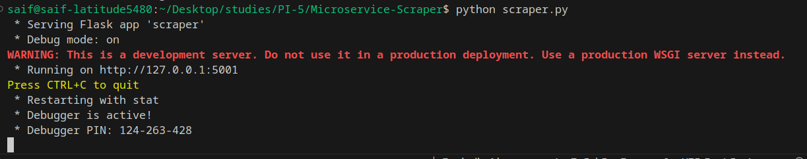
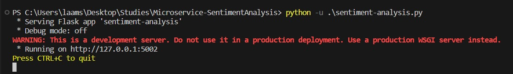
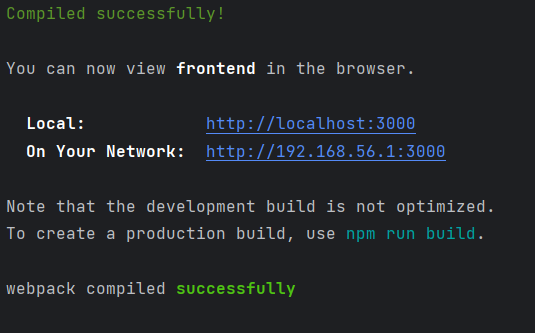

# Projet Integre S5 - BETTAOUI / LAAMOUMRI / MALKI

## Execution du Projet :

Apres avoir telecharge les differents microservices, il faut extraire le contenue de ressources.rar dans le meme repertoire qui se trouve dans le microservice Sentiment analysis

Ensuite il faut lancer les differents microservices avec l'ordre suivant (Scrapper -> Sentiment Analysis -> Backend -> Frontend)

Dans le microservice Sentiment Analysis lancer l'application flask nommé sentiment-analysis.py

Apres avoir lancer les differents microservices, vous pouvez lancer une requete depuis le frontend dans l'onglet Request Settings et visualiser le resultat depuis l'onglet Tweets.

<br>
<br>

## Clone the project :

Clone the repository to your local machine:

```bash
git clone https://github.com/Wulfin/PI-5.git
```

<br>
<br>

## Microservice du Twitter Scraper Flask API

Ce microservice implémente une API Flask pour le scraping de tweets en utilisant un navigateur sans tête (Selenium) et BeautifulSoup. Il vous permet de rechercher des tweets en fonction d'un terme de recherche spécifié et de récupérer des informations pertinentes telles que les noms d'utilisateur, le texte des tweets, la date et l'heure, les réponses, les retweets et les likes.

Prérequis
Avant d'exécuter le projet, assurez-vous d'avoir les dépendances suivantes installées :

  Python (version 3.6 ou supérieure)
  Flask
  Selenium
  BeautifulSoup
  Firefox 

```bash
pip install flask selenium beautifulsoup4
```

Après on accède au dossier du microservice et on lance le microservice :
```bash
cd Microservice-Scraper
pyhton scraper.py
```


<br>
<br>

## Microservice du Sentiment Analysis Flask API
Ce microservice implémente une API Flask pour l'analyse de sentiment des tweets. Il utilise un modèle d'apprentissage automatique pré-entraîné pour prédire le sentiment des tweets fournis. Le modèle d'analyse de sentiment est basé sur la régression logistique et est entraîné sur un ensemble de données contenant des tweets positifs et négatifs.

Prérequis
Avant d'exécuter le projet, assurez-vous d'avoir les dépendances suivantes installées :

Python (version 3.6 ou supérieure)
Flask
NLTK
scikit-learn
pandas
requests
Vous pouvez installer ces dépendances en utilisant la commande suivante :
```bash
pip install flask nltk scikit-learn pandas requests
```
Puis on accède au dossier du microservice et on lance le server :
```bash
cd Microservice-SentimentAnalysis
pyhton app.py
```


<br>
<br>

## Application Backend

Cette application Spring Boot sert de backend pour un système de gestion des tweets. Elle utilise Spring Data JPA pour la persistance des données et communique avec d'autres services en utilisant des Feign Clients. L'application offre des points d'accès pour récupérer et manipuler les données des tweets.

### Démarrage

Suivez les étapes ci-dessous pour exécuter le projet (en supposant que le dépôt a déjà été cloné) :

1. Accédez au répertoire du projet :

```bash
cd Microservice-Backend
```

2. Lancez l'application Spring Boot (comme le projet fonctionne avec H2, la base de données est déjà configurée) :

```bash
java -jar target/Backend-0.0.1-SNAPSHOT.jar
```

L'application démarrera sur `http://localhost:8080/`.


<br>
<br>

## Application Frontend de Gestion des Tweets

Cette application React fournit une interface utilisateur pour la gestion et la visualisation des tweets. Elle interagit avec une API backend pour récupérer et afficher les données des tweets, et inclut des fonctionnalités telles que la configuration des paramètres de requête et la représentation graphique des données.

### Démarrage

Suivez les étapes ci-dessous pour exécuter le projet :

1. Accédez au répertoire du projet :

```bash
cd Microservice-Frontend
```

2. Installez les dépendances du projet avec npm :

```bash
npm install
```

3. Lancez l'application React :

```bash
npm start
```

L'application démarrera sur `http://localhost:3000/`.


